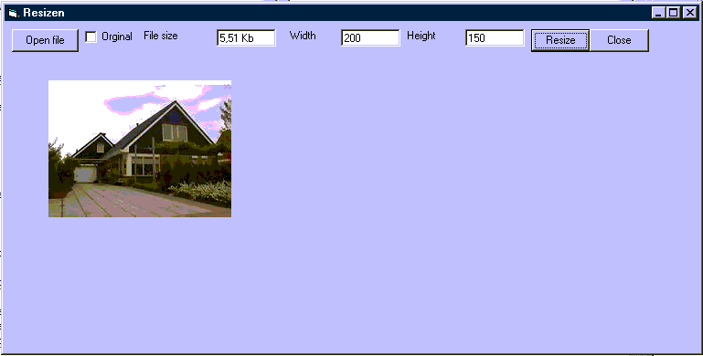



## Resize Images

### Description

This piece of code can resize/scale your images to a smaller file. So now you don't need any expensive thirdparty controls to resize your images!

You will need the following DLL: DiJPG.DLL which you can find on: www.disoft.com/dijpg.htm
 
### More Info
 
You will need the following DLL: DiJPG.DLL which you can find on: www.disoft.com/dijpg.htm

             |
---                |---
**Submitted On**   |2002-08-06 00:58:36
**By**             |[A van Ginneken](https://github.com/Planet-Source-Code/PSCIndex/blob/master/ByAuthor/a-van-ginneken.md)
**Level**          |Intermediate
**User Rating**    |3.5 (28 globes from 8 users)
**Compatibility**  |VB 6\.0
**Category**       |[Graphics](https://github.com/Planet-Source-Code/PSCIndex/blob/master/ByCategory/graphics__1-46.md)
**World**          |[Visual Basic](https://github.com/Planet-Source-Code/PSCIndex/blob/master/ByWorld/visual-basic.md)
**Archive File**   |[Resize\_Ima114738852002\.zip](https://github.com/Planet-Source-Code/a-van-ginneken-resize-images__1-37649/archive/master.zip)

